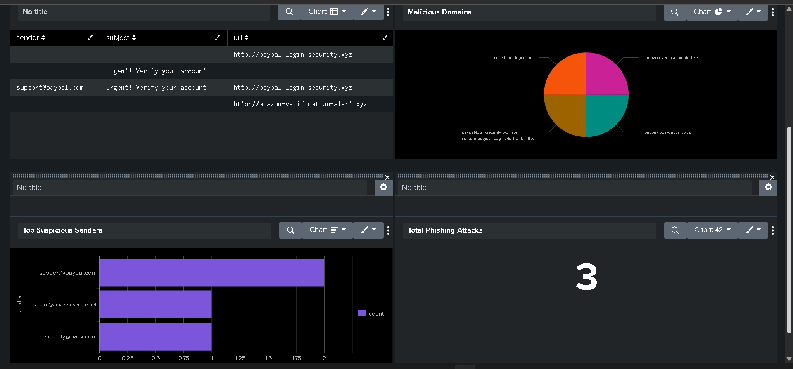

# phishing-detection-splunk
# Phishing Detection using Splunk

## 📌 Objective

Detect phishing emails and extract malicious URLs using SIEM.

## 🛠 Tools Used

* Splunk
* VirusTotal
* Hybrid Analysis

## 🔍 Steps Performed

* Uploaded email log data into Splunk
* Searched for phishing keywords (urgent, verify)
* Extracted URLs using regex
* Identified suspicious domains
* Verified URLs using VirusTotal

## 🚨 IoCs Identified

* paypal-login-security.xyz
* amazon-verification-alert.xyz

## 📊 Dashboard

## ✅ Conclusion

Successfully detected phishing emails and visualized attack patterns using Splunk.
